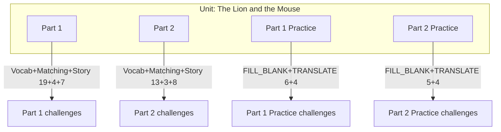

# The Lion and the Mouse 单元设计计划

## 需求概述

为 The Lion and the Mouse 故事设计新单元，直接向本地 Cloudflare D1 数据库插入数据内容。

故事与词汇：

**Part 1:** A lion was sleeping under a tree. A little mouse was playing around the lion. Squeak, squeak. Suddenly the lion woke up. Who woke me up? I will eat you. The lion picked up the mouse and opened his mouth. Oh no, please don't eat me. If you'll let me go, I will help you one day.

**Part 2:** You? I'm a lion and you're a mouse, what can you do? The lion laughed. Fine I'll let you go. The mouse ran away. The next day, the lion got caught in a trap. The mouse who saw this ran to the lion. It began to chew the rope. Thank you saved my life. From that day, the lion and mouse became best friends.

**词汇分组：**


| 部分     | 段落内容                          | 词汇数量 |
| ------ | ----------------------------- | ---- |
| Part 1 | 狮子睡觉、老鼠玩耍、狮子醒来、抓住老鼠、老鼠求饶、承诺帮助 | 19 词 |
| Part 2 | 狮子嘲笑、放走老鼠、第二天落陷阱、老鼠咬绳、救命、成为朋友 | 13 词 |


**Lesson 结构（共 4 个）：**


| 序号  | Lesson 类型       | 数量  | Challenge 类型                                         |
| --- | --------------- | --- | ---------------------------------------------------- |
| 1   | Part 1          | 1   | SELECT_TRANSLATION + MATCH_PAIRS + TRANSLATE（19+4+7） |
| 2   | Part 2          | 1   | SELECT_TRANSLATION + MATCH_PAIRS + TRANSLATE（13+3+8） |
| 3   | Part 1 Practice | 1   | FILL_BLANK + TRANSLATE（6+4）                          |
| 4   | Part 2 Practice | 1   | FILL_BLANK + TRANSLATE（5+4）                          |


**数据统计：** 1 Unit + 4 Lessons + 73 Challenges（30+24+10+9）。插入时无需指定 id，schema 中主键为自增，由数据库分配。

---

## 一、完整插入内容预览（供审阅）

### 1. Unit 与 Lessons


| 表       | 插入内容                                                                                                                                |
| ------- | ----------------------------------------------------------------------------------------------------------------------------------- |
| units   | subject_id=2（Fairy Tales）, title='The Lion and the Mouse', description='A fable about kindness and helping others'；id、order 由执行阶段决定 |
| lessons | 见下表；id、unit_id、order 由执行阶段决定                                                                                                        |


| title           | order（课内顺序） |
| --------------- | ----------- |
| Part 1          | 0           |
| Part 2          | 1           |
| Part 1 Practice | 2           |
| Part 2 Practice | 3           |


### 1.1 各 Lesson 题型与数量总览


| Lesson 标题       | 题型                                           | 数量     |
| --------------- | -------------------------------------------- | ------ |
| Part 1          | SELECT_TRANSLATION + MATCH_PAIRS + TRANSLATE | 19+4+7 |
| Part 2          | SELECT_TRANSLATION + MATCH_PAIRS + TRANSLATE | 13+3+8 |
| Part 1 Practice | FILL_BLANK + TRANSLATE                       | 6+4    |
| Part 2 Practice | FILL_BLANK + TRANSLATE                       | 5+4    |


---

### 2. Lesson 19 — Part 1（Vocabulary 19 + Matching 4 + Story 7）

#### 2.1 Part 1 Vocabulary（19 个 SELECT_TRANSLATION）


| #   | 单词 (question) | 正确选项  | 干扰项1  | 干扰项2  |
| --- | ------------- | ----- | ----- | ----- |
| 1   | lion          | 狮子    | 老虎    | 兔子    |
| 2   | sleeping      | 睡觉    | 跑步    | 说话    |
| 3   | under         | 在……下面 | 在……上面 | 在……里面 |
| 4   | tree          | 树     | 花     | 草     |
| 5   | little        | 小小的   | 巨大的   | 凶猛的   |
| 6   | mouse         | 老鼠    | 狮子    | 蛇     |
| 7   | playing       | 玩耍    | 睡觉    | 吃     |
| 8   | around        | 在周围   | 在里面   | 在远处   |
| 9   | suddenly      | 突然    | 慢慢    | 从不    |
| 10  | woke          | 醒来    | 睡着    | 跑走    |
| 11  | eat           | 吃     | 放     | 帮     |
| 12  | pick up       | 抓起    | 放下    | 打开    |
| 13  | open          | 打开    | 关上    | 抓住    |
| 14  | mouth         | 嘴巴    | 耳朵    | 尾巴    |
| 15  | his           | 他的    | 她的    | 他们的   |
| 16  | please        | 请；拜托  | 不要    | 快点    |
| 17  | let me go     | 让我走   | 抓住我   | 吃掉我   |
| 18  | help          | 帮助    | 吃掉    | 嘲笑    |
| 19  | one day       | 有一天   | 昨天    | 明天    |


#### 2.2 Part 1 Matching（4 个 MATCH_PAIRS）

每个 challenge 的 question 均为：`Match the English words with their Chinese translations.`

**第 1 个**（5 对）：lion↔狮子, sleeping↔睡觉, under↔在……下面, tree↔树, little↔小小的

**第 2 个**（5 对）：mouse↔老鼠, playing↔玩耍, around↔在周围, suddenly↔突然, woke↔醒来

**第 3 个**（5 对）：eat↔吃, pick up↔抓起, open↔打开, mouth↔嘴巴, his↔他的

**第 4 个**（5 对，含复习）：please↔请；拜托, let me go↔放了我, help↔帮助, one day↔有一天, lion↔狮子

#### 2.3 Part 1 Story Sentences（7 个 TRANSLATE）

覆盖原文：*A lion was sleeping under a tree. A little mouse was playing around the lion. Suddenly the lion woke up. Who woke me up? I will eat you. The lion picked up the mouse and opened his mouth. Oh no, please don't eat me. If you'll let me go, I will help you one day.*


| #   | 原文                                                 | 正确词块（按 order，is_correct=1）            | 干扰项（is_correct=0，共 2 个） |
| --- | -------------------------------------------------- | ------------------------------------- | ----------------------- |
| 1   | A lion was sleeping under a tree.                  | 一只 · 狮子 · 在 · 树下 · 睡觉                 | 老鼠、陷阱                   |
| 2   | A little mouse was playing around the lion.        | 一只 · 小 · 老鼠 · 在 · 狮子 · 周围 · 玩耍        | 吃掉                      |
| 3   | Suddenly the lion woke up.                         | 突然 · 狮子 · 醒 · 了                       | 老鼠、陷阱                   |
| 4   | Who woke me up? I will eat you.                    | 谁 · 把 · 我 · 吵醒 · 我 · 要 · 吃掉 · 你       | 放了我、帮助                  |
| 5   | The lion picked up the mouse and opened his mouth. | 狮子 · 抓起 · 老鼠 · 张开了 · 他的 · 嘴巴          | 跑走、陷阱                   |
| 6   | Oh no, please don't eat me.                        | 哦不 · 拜托 · 不要 · 吃 · 我                  | 狮子、抓住                   |
| 7   | If you'll let me go, I will help you one day.      | 如果 · 你 · 放了 · 我 · 有一天 · 我 · 会 · 帮 · 你 | 吃掉、陷阱                   |


---

### 3. Lesson 20 — Part 2（Vocabulary 13 + Matching 3 + Story 8）

#### 3.1 Part 2 Vocabulary（13 个 SELECT_TRANSLATION）


| #   | 单词 (question) | 正确选项  | 干扰项1 | 干扰项2 |
| --- | ------------- | ----- | ---- | ---- |
| 1   | do            | 做     | 吃    | 睡    |
| 2   | laugh         | 大笑    | 哭    | 睡    |
| 3   | run away      | 跑走    | 留下   | 睡觉   |
| 4   | next          | 下一个   | 上一个  | 第一个  |
| 5   | next day      | 第二天   | 昨天   | 去年   |
| 6   | caught        | 抓住；被困 | 放走   | 打开   |
| 7   | trap          | 陷阱    | 树    | 嘴巴   |
| 8   | saw           | 看见    | 听见   | 闻到   |
| 9   | ran           | 跑     | 走    | 睡    |
| 10  | began         | 开始    | 结束   | 忘记   |
| 11  | saved my life | 救了我的命 | 吃掉我  | 抓住我  |
| 12  | from that day | 从那天起  | 昨天   | 明天   |
| 13  | became        | 成为    | 离开   | 忘记   |


#### 3.2 Part 2 Matching（3 个 MATCH_PAIRS）

**第 1 个**（5 对）：do↔做, laugh↔大笑, run away↔跑走, next↔下一个, next day↔第二天

**第 2 个**（5 对）：caught↔抓住；被困, trap↔陷阱, saw↔看见, ran↔跑, began↔开始

**第 3 个**（5 对，含复习）：saved my life↔救了我的命, from that day↔从那天起, became↔成为, do↔做, laugh↔大笑

#### 3.3 Part 2 Story Sentences（8 个 TRANSLATE）

覆盖原文：*You? I'm a lion and you're a mouse, what can you do? The lion laughed. Fine I'll let you go. The mouse ran away. The next day, the lion got caught in a trap. The mouse who saw this ran to the lion. It began to chew the rope. Thank you. You saved my life. From that day, the lion and the mouse became best friends.*


| #   | 原文                                                                 | 正确词块（按 order，is_correct=1）                  | 干扰项（is_correct=0，共 2 个） |
| --- | ------------------------------------------------------------------ | ------------------------------------------- | ----------------------- |
| 1   | I'm a lion and you're a mouse, what can you do?                    | 我是 · 狮子 · 你 · 是 · 老鼠 · 你能 · 做 · 什么          | 陷阱、跑走                   |
| 2   | The lion laughed.                                                  | 狮子 · 笑了                                     | 老鼠、陷阱                   |
| 3   | Fine, I'll let you go.                                             | 好吧 · 我 · 放 · 你 · 走                          | 吃掉、抓住                   |
| 4   | The mouse ran away.                                                | 老鼠 · 跑 · 走了                                 | 狮子、陷阱                   |
| 5   | The next day, the lion got caught in a trap.                       | 第二天 · 狮子 · 被困在 · 陷阱                         | 老鼠、跑走                   |
| 6   | The mouse who saw this ran to the lion and began to chew the rope. | 看见这一幕 · 的 · 老鼠 · 跑到 · 狮子 · 那儿 · 开始 · 咬 · 绳子 | 大笑、放走                   |
| 7   | Thank you. You saved my life.                                      | 谢谢你 · 你 · 救 · 了 · 我的 · 命                    | 陷阱、跑走                   |
| 8   | From that day, the lion and the mouse became best friends.         | 从 · 那天 · 起 · 狮子 · 和 · 老鼠 · 成了 · 最好的 · 朋友    | 陷阱、大笑                   |


---

### 4. Lesson 21–22 — Part 1 / Part 2 Practice（Fill Blank + New Sentences）

#### 4.1 词汇覆盖

- **Part 1 Practice**：lion, sleep, under, tree, little, mouse, play, around, suddenly, wake, eat, pick up, open, mouth, please, let me go, help, one day 等
- **Part 2 Practice**：do, laugh, run away, next day, caught, trap, saw, ran, began, saved my life, from that day, became 等

#### 4.2 Lesson 21 — Part 1 Practice：11 题（FILL_BLANK 6 + TRANSLATE 4）

**FILL_BLANK 题目明细**（新场景：动物园、家里、教室等，覆盖 Part 1 词汇）


| #   | Sentence                                    | Answer   | Distractors       | 说明                                   |
| --- | ------------------------------------------- | -------- | ----------------- | ------------------------------------ |
| 1   | In the zoo the ___ was sleeping in the sun. | lion     | trap, tree        | 动物园场景；trap/tree 不能作「睡觉」的主语，仅 lion 合理 |
| 2   | The dog hid ___ the table.                  | under    | around, open      | 家里场景；需介词「在……下面」                      |
| 3   | My ___ brother likes to draw.               | little   | sudden, one       | 家庭场景；需形容词「小小的」                       |
| 4   | ___ the bell rang and we ran to class.      | Suddenly | Please, One day   | 学校场景；需「突然」                           |
| 5   | Can you ___ up the keys for me?             | pick     | open, let         | 日常请求；需动词 pick up 的 pick              |
| 6   | ___ don't eat my lunch!                     | Please   | Suddenly, One day | 请求语气；需「请；拜托」                         |


**TRANSLATE（New Sentences）题目明细**（新场景，非故事剧情）


| #   | question                             | 正确词块（按 order，is_correct=1） | 干扰项（is_correct=0，共 2 个） |
| --- | ------------------------------------ | -------------------------- | ----------------------- |
| 1   | The cat was sleeping under the tree. | 猫 · 在 · 树下 · 睡觉            | 老鼠、陷阱                   |
| 2   | The little boy wanted to play.       | 小 · 男孩 · 想要 · 玩耍           | 狮子、吃掉                   |
| 3   | He opened his mouth and yawned.      | 他 · 张开 · 他的 · 嘴巴 · 打了哈欠    | 老鼠、陷阱                   |
| 4   | One day I will help you.             | 有一天 · 我 · 会 · 帮 · 你        | 吃掉、抓住                   |


#### 4.3 Lesson 22 — Part 2 Practice：9 题（FILL_BLANK 5 + TRANSLATE 4）

**FILL_BLANK 题目明细**（新场景：日常、学校、医院等，覆盖 Part 2 词汇）


| #   | Sentence                            | Answer  | Distractors  | 说明                            |
| --- | ----------------------------------- | ------- | ------------ | ----------------------------- |
| 1   | She ___ at his joke.                | laughed | ran, saw     | 日常；需动词「大笑」                    |
| 2   | The rabbit ___ away when it saw us. | ran     | began, saved | 户外；需 run away 的 ran           |
| 3   | The ___ day we went to the park.    | next    | trap, rope   | 需 next day 的「第二天」之 next       |
| 4   | He ___ to sing a song.              | began   | ran, caught  | 需动词「开始」                       |
| 5   | The doctor ___ my life.             | saved   | caught, ran  | 医院/感恩；需 saved my life 的 saved |


**TRANSLATE（New Sentences）题目明细**（新场景，非故事剧情）


| #   | question                                | 正确词块（按 order，is_correct=1） | 干扰项（is_correct=0，共 2 个） |
| --- | --------------------------------------- | -------------------------- | ----------------------- |
| 1   | She laughed when she heard the joke.    | 她 · 听到 · 笑话 · 后 · 笑了       | 陷阱、跑走                   |
| 2   | The next day he was caught in the rain. | 第二天 · 他 · 被 · 雨 · 困 · 住了   | 老鼠、大笑                   |
| 3   | She began to read the book.             | 她 · 开始 · 读 · 那本 · 书        | 狮子、跑走                   |
| 4   | From that day we became friends.        | 从 · 那天 · 起 · 我们 · 成了 · 朋友  | 陷阱、放走                   |


---

## 二、执行前检查清单

执行 `seed_lion_mouse.sql` 前请确认：


| 检查项        | 说明                                                                                                                                              |
| ---------- | ----------------------------------------------------------------------------------------------------------------------------------------------- |
| subject 存在 | `subject_id=2`（Fairy Tales）必须已存在；                                                                                                               |
| ID         | schema 中主表 id 均为自增（`units`/`lessons`/`challenges`/`challenge_options`），插入时不指定 id，由数据库分配；插入子表时用上一步得到的 id 作为外键即可（如先插 unit，再插 lessons 时填该 unit_id） |
| 表结构        | 表 `units`、`lessons`、`challenges`、`challenge_options` 已创建（参考 `src/db/schema.ts`）                                                                 |


---

## 三、使用 Wrangler 向本地 D1 插入数据

本项目使用 Cloudflare D1，数据库在 `wrangler.json` 中配置为 `juolingo-db`。向**本地** D1 插入数据需使用 Wrangler 的 `d1 execute` 命令。

### 3.1 基本用法

在项目根目录执行：

```bash
npx wrangler d1 execute juolingo-db --local --file=src/db/seed_lion_mouse.sql
```

- `juolingo-db`：与 `wrangler.json` 里 `d1_databases[].database_name` 一致。
- `--local`：操作本地 D1（`.wrangler/state/` 下的 SQLite），不涉及远程 Cloudflare。
- `--file=...`：要执行的 SQL 文件路径（相对项目根目录）。

---

## 四、架构示意




